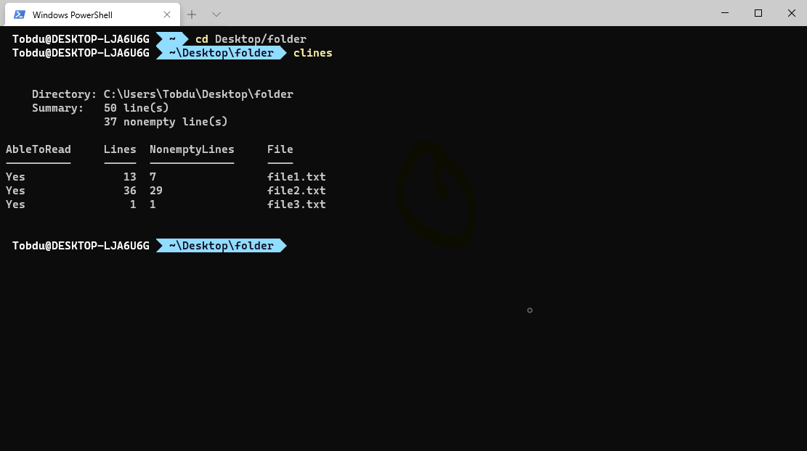
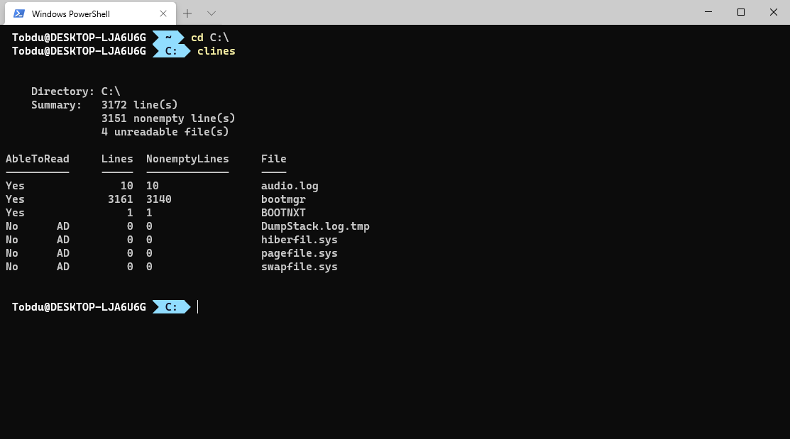
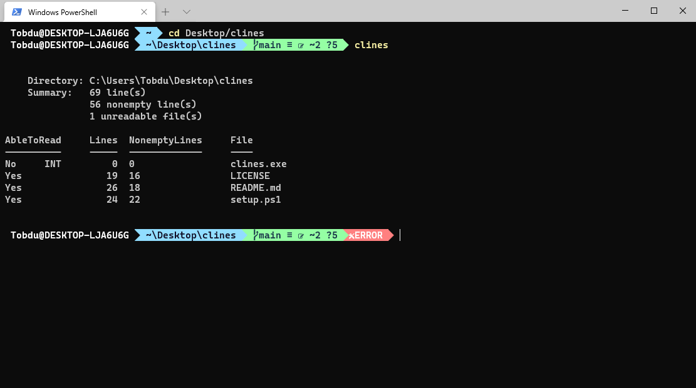

<h1 style="text-align:center">CLines</h1>

Program for calculating the amount of lines in files in a directory

---

###Setup
- Open a terminal with administrator privileges and go to the directory where you downloaded this repo.
- In the directory, there should be at least two files, `clines.exe` and `setup.ps1`. If you are using command prompt, type in `powershell .\setup.ps1` or if you are using powershell, just type in `.\setup.ps1`
- Follow the steps, which will be shown in your terminal while you run the script

---

###Usage
- If you set up the program successfully with the setup instructions above, you should now be able to run the program by simply typing `clines` in your terminal.
- After that, you should see a list of files, and the amount of lines in the file. For more specific information see [examples](#examples) below
- If you decided not to add the program to path, or the setup failed, you have to type the full path to the `clines.exe` program to use it
- CLines supports basic filtering, for example if you type `clines /e` the program will display the files, and it's encoding

###Note
- The calculation speed depends on the file size in the directory. If a file has more than few thousand lines, the calculation process may take few seconds
- The source code of the program is located in the `source` directory. To convert the program to `.exe` manually, use [pyinstaller](https://pypi.org/project/pyinstaller/)

### Error Messages
If reading a file failed for some reason, it will be shown in the `AbleToRead` column
- AD = Access Denied. Reading the file was denied by system
- INT = Interrupted. Reading the file failed, because the process was interrupted

---

###Examples

    
    
    

